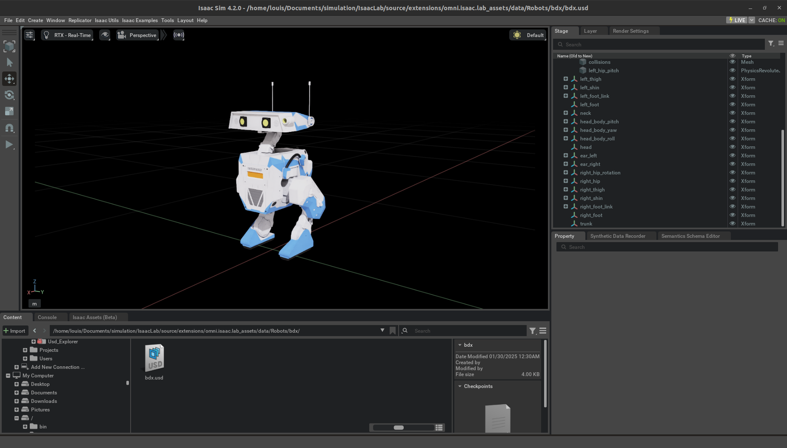

# Disney BD-X USD Description

This repository contains the USD Description file for the BD-X robot from Disney. It is derived from the original [AWD repository](https://github.com/rimim/AWD/blob/main/awd/data/assets/go_bdx/go_bdx.urdf). The license is a `NVIDIA License`

## Changes Made:
- **Mesh Format**: The original meshes were converted to `.dae` format to allow texture application in Blender.
- **URDF Modifications**: 
  - Replaced original `.urdf` with one that uses the modified `.dae` meshes.
  - Removed the silver material previously applied to all parts.
  - Eliminated the `transmissions` and `gazebo` tags.
  - Added `<dynamics damping="0.0" friction="0.0"/>` to each revolute joint.

These modified files can be found in the `urdf` directory.

## Visuals:
- **USD Model Preview**: 
- **Locomotion Video**: 
<video width="100%" controls>
  <source src="rl-video-step-22000.mp4" type="video/mp4">
  Your browser does not support the video tag.
</video>